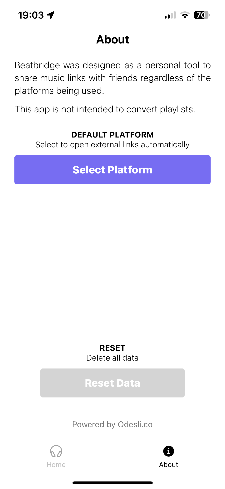
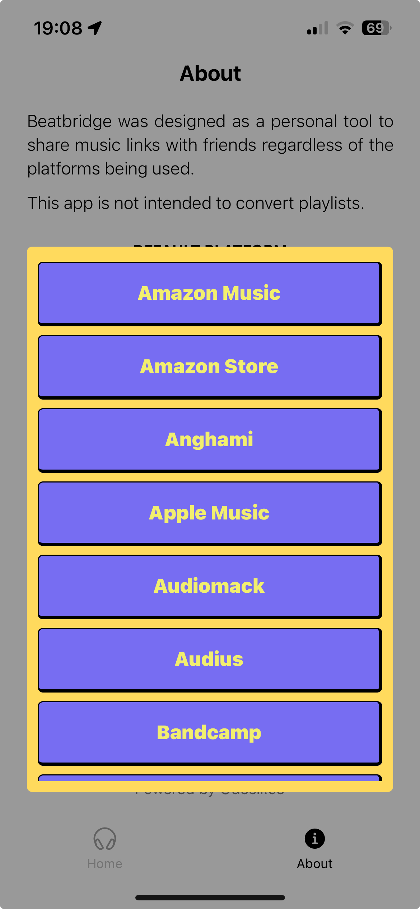

BeatBridge was originally designed from the perspective of trying to share a music link, so copying a new link to my clipboard made sense. However, as more people get their hands on it, it's clear there are still some problems that BeatBridge needs to resolve.

## BeatBridge needs better UX for user's *receiving* music links

After user feedback, I learned that I needed to pay attention to users who receive links from others. In order to include them and make their lives easier with the app, I had to add a feature that would allow the user to open their preferred platform directly instead of copying a new link to their clipboard.

### Feature Implementation Idea

My first reaction was to add a whole new app state, and allow the user to *toggle* between a `recieving` or `sharing` state but that made me cringe almost instantly. Even though it's useful to have tools like `useState`, it's easy to overuse them and cause bloat in your app.

Thankfully there are other options, and the quickest one to implement was using the `onLongPress` callback function available within the `TouchableOpacity` component, which enables triggering an action by long pressing on a button.

#### Reducing unnecessary complexity

In the case of `useState`, the app would need more UI components to simply display the new state, when ultimately the end result/action (opening the link to another app) is not that different from copying a link to the clipboard in the first place.

Using `TouchableOpacity` for the buttons that list the available platforms, long pressing on one would open the link on the user's phone, and tapping would copy the link instead.

I have to see what tester's think of this implementation, but I also want to add a setting within the app that lets users select their preferred streaming platform so they get redirected automatically after pasting a link from a differing platform.

### State Management Revisited

I chose to use `react-native-mmkv-storage` and `zustand` for state management since both are lightweight and fast. When putting the project together, I didn't realize that even though I set up mmkv correctly:

```js
// mmkv.js
import { MMKV } from "react-native-mmkv";

const storage = new MMKV({
  id: 'song-storage',
});

export default mmkvStorage = {
  setItem: (name, value) => (storage.set(name, value)),
  getItem: (name) => (storage.getString(name) ?? null),
  removeItem: (name) => (storage.delete(name)),
};
```

```js
// zustand-store.js
import mmkvStorage from './mmkv';

export default useStore = create(
  persist(
    (set) => ({
      // key/val pairs
      ...initialState,
      // actions
      update: ({ newState }) => set(() => ({ newState })),
    }),
    {
      name: 'song-storage',
      storage: createJSONStorage(() => mmkvStorage),
    }
  )
);
```

The data types are different if accessing data directly from `mmkvStorage` compared to retrieving and updating state through `useStore`. It took me a moment to pinpoint the issue, which made me appreciate TypeScript a little bit...

### Automating Links

Now that state management is resolved, I added a dropdown in the About tab of the app to allow users to select their preferred platform. There is also a new button to reset the data cache.





BeatBridge is slowly approaching a completed state! As a result, I am making the beta open invite! Here is a link to access the app:

[BeatBridge iOS Open Beta](https://testflight.apple.com/join/JSaQ32JQ)
