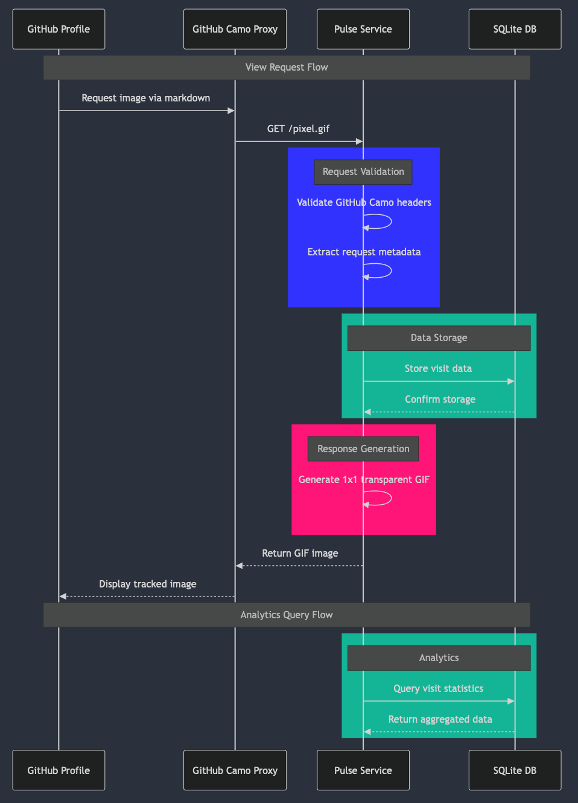

I recently completed an online training academy called Kura Labs, which is focused on teaching Cloud Infrastructure. In the coming weeks I will share a writeup of my experience building the final project for the program after cleaning up some code and adding more documentation.

In the meantime, I used my break after Kura to dive into Rust by building _Pulse_ - a lightweight analytics tool that tracks views on GitHub profiles. Here's what I learned along the way.

## Why Rust?

After years of working with various languages from Javascript and Python to C/C++ for embedded systems, Rust caught my attention for its promise of memory safety without sacrificing performance. Coming from an electrical engineering background where efficiency matters, I appreciated Rust's zero-cost abstractions.

Building a web application in Rust is a great way to get familiar with the language and its ecosystem, since web frameworks like Actix Web can abstract away many of the low-level details of web development. I chose to use Actix Web over Rocket because Actix Web also exposes low-level implementations for customizations, making it a good choice for a verstatile framework in a new language.

## The Project: GitHub Profile Analytics

The concept is simple: track the views on my personal Github profile using a 1x1 transparent GIF pixel.

Pulse uses Actix Web and an async Rust library called SQLx for database interactions. Most of the heavy lifting for async programming is handled by Tokio, which is a dependency of Actix Web and SQLx. The project is structured into three main components: the main application, the database schema, and the analytics API.

### System Architecture



### Core Components

1. Tracking Endpoint (`/pixel.gif`): A simple endpoint that serves a transparent GIF while logging visitor data to the database. The endpoint is protected by a simple request validation system. It checks the `User-Agent` header to ensure the request is coming from GitHub's Camo proxy system, which Github uses to serve images in Markdown files, to protect users and prevent abuse.

    ```rust
    #[get("/pixel.gif")]
    async fn pixel(req: HttpRequest, state: web::Data<AppState>) -> Result<HttpResponse> {
        let user_agent = req
            .headers()
            .get("User-Agent")
            .and_then(|h| h.to_str().ok())
            .unwrap_or("unknown")
            .to_string();
    
        // Validate GitHub Camo requests
        let is_github_request = user_agent.contains("github-camo");
        if !is_github_request {
            return Ok(HttpResponse::Forbidden().finish());
        }
        
        // ... existing code ...
    }
    ```

2. Analytics API: A `/stats` endpoint that aggregates view statistics with SQL queries:

    ```rust
    #[derive(Serialize)]
    struct Stats {
        total_views: i64,
        views_today: i64,
        views_this_week: i64,
        recent_views: Vec<ViewLog>,
    }
    ```

3. Database: A simple SQLite database that stores the pixel hits:

    ```sql
    CREATE TABLE IF NOT EXISTS pixel_hits (
      id INTEGER PRIMARY KEY AUTOINCREMENT,
      ip_address TEXT NOT NULL,
      user_agent TEXT,
      camo_id TEXT,
      timestamp DATETIME NOT NULL
    );
    ```

### Learning Points

1. Async Rust: Coming from JavaScript/TypeScript in my web development work, Rust's async system was interesting. The explicit handling of futures and async/await syntax felt more controlled than JavaScript's event loop, which may feel less deterministic.

2. Type System: After working with TypeScript extensively in mobile development, Rust's type system felt familiar yet more robust. The compiler's error messages were surprisingly helpful in understanding ownership concepts. The '&' operator expresses a reference to a value, which is similar to pointers in C/C++.

3. SQL with Safety: Using SQLx provided a nice balance between raw SQL and type safety:

    ```rust
    let total_views: i64 = sqlx::query!(
        "SELECT COUNT(*) AS count FROM pixel_hits" 
    )
        .fetch_one(&state.db)
        .await?
        .count
        .into();
    ```

## Technical Challenges

1. Request Validation: Implementing proper request validation was crucial. Instead of switching focus to another project, I focused on GitHub's Camo proxy system after learning that I can't track a user's IP address directly. The `User-Agent` header is a common way to identify a request's source:

    ```json
    {
      "user-agent": "github-camo (<hash>)",
      "via": "HTTP/1.1 github-camo (<hash>)",
      "x-forwarded-proto": "https"
    }
    ```

2. Github Camo Proxy: Although I was able to validate the request, I am unable to ensure that this server would not be abused by malicious actors. The headers in the request can be spoofed if no authentication is required, and authentication is virtually impossible to implement if there is no way to store hidden variables in the Github Profile. The URL is in plaintext in a markdown file, so any tokens or secrets can be easily extracted.

3. Documentation while learning: Having an ideal developer workflow is an ongoing process, so using this blog is a great way to document my learnings and progress. I am looking for ways to incorporate tangential actions into my documentation, especially my git commit history, as that can be a useful reference for writing future posts.

## Future Improvements

As a proof of concept, there's room for enhancement:

- Rate limiting implementation
- Using handlers to allow for more flexibility in the API (more github users, etc)
- Geographic distribution analysis of Camo proxies
- Comprehensive test suite
- Authentication system for non-GitHub usage

## Conclusion

This project was an excellent way to learn Rust while building something practical. Although simple, I was able to experiment with a variety of Rust concepts and libraries, and I learned a lot about the language and its ecosystem. The source code is available on my GitHub, and I welcome feedback from fellow engineers interested in Rust or analytics systems.
