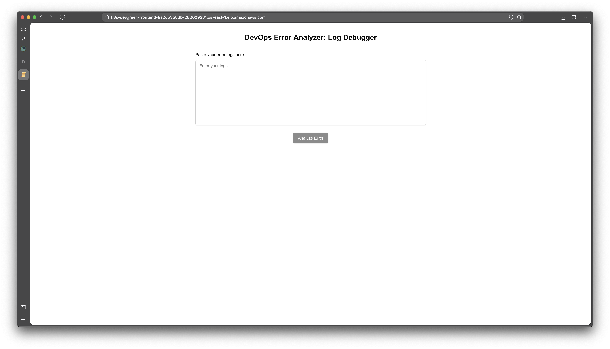
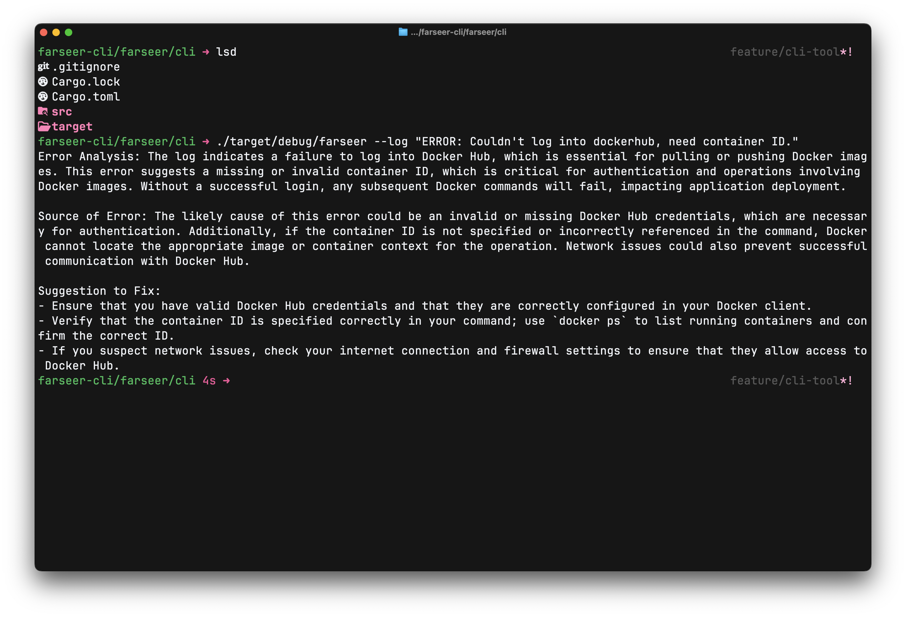

Last month, I graduated as part of the fifth cohort at [Kura Labs](https://www.kuralabs.org/), a training academy focused on Cloud Infrastructure. The final assignment was to choose an open-source project and build cloud infrastructure for it in a few weeks. Since I had been researching LLMs and agentic systems, I decided to make my own app instead. Combining the concepts of Cloud Infrastructure and LLMs, I built Farseer, a log analysis tool for DevOps teams.

## Farseer

I leveraged the [OpenAI API](https://platform.openai.com/docs/introduction) to generate log analysis queries, and used the LLM programming library, [ell](https://docs.ell.so/), to run the queries and store the results in a PostgreSQL database. Having used LangChain in a previous project, I was interested in exploring ell's implementation of programmable conversations.

The backend was built in Python with FastAPI and uvicorn, an [ASGI](https://asgi.readthedocs.io/en/latest/) (async) web server framework. Development is similar to Flask in that FastAPI uses Python decorators to define routes and request handlers. The frontend was written as a simple single page app with Typescript and Next.js, which uses React for rendering components.

As an added bonus, I created an additional CLI tool written in Rust to interact with the API and generate results in the terminal.

> I chose to keep the database as a development feature, since security could be a concern for a production application that stores potentially sensitive data.

### System Architecture

Farseer was deployed using Jenkins and Terraform. The Jenkins pipeline was connected to the project repository and triggered on every commit via a webhook. The pipeline handles multi-environment deployments using branch naming conventions in a blue-green deployment strategy, enabling zero-downtime updates. Jenkins runs tasks for each build including building the application itself, running tests, creating the Docker images, pushing them to Docker Hub, provisioning the cluster resources in the cloud with Terraform, and deploying the services to the cluster.

#### Blue-Green Deployment

All of this was hosted on a Kubernetes cluster using AWS EKS and Terraform. The cluster was configured to automatically scale up and down based on the number of requests to server. In order to accomplish this, my team used Docker to containerize the backend and frontend services. This allowed us to pull the images from Docker Hub and deploy pods to the cluster without worrying about the underlying host machines.

Before settling on Kubernetes, I had previously used AWS EC2 instances to host the backend and frontend services. I started with a single EC2 instance for both the frontend and backend, then slowly built out the infrastructure as I needed it. This approach worked well for learning different container orchestration tools.

#### Docker Swarm

We started by containerizing the services with Docker then graduated to Docker Swarm, which proved to be challenging to debug and maintain. We wanted the backend and frontend to be deployed independently on nodes in different subnets, but networking on Docker Swarm was not straightforward. I had to first automate the creation of a custom overlay network, then configure the backend and frontend services to use the network. Ngninx was initially configured on the host machine directly, but this caused issues with the overlay network, which meant that we had to implement a third ngninx _container_ to handle traffic to the frontend. Because of this overhead, we decided to use the time we had left to pivot our infrastructure to using Kubernetes.

#### Kubernetes

Although this was a significant change and required a lot of learning, Kubernetes proved to be more efficient, robust and scalable. The biggest challenge was working with IAM Roles. Being in the habit of "starting small", I learned to build a Kubernetes cluster with a single node on given subnets using the command line, but using the same commands in a script that was meant to be automated caused issues when working with Terraform. It turns out that Terraform can handle the IAM Roles for us, so we were able to use Terraform to provision the cluster and then use a few commands in a script to deploy the services to the cluster. All in all, what resulted was a project with higher legibility and maintainability.

#### Networking

The design of the infrastructure for Farseer was iterative, starting with a custom VPC in one region (us-east-1). For redundancy, we used two availability zones (us-east-1a and us-east-1b). For Docker Swarm, each availability zone was configured with a private and public subnet, each with their own bastion and application hosts. The overlay network spanned the two subnets on each availability zone, allowing the backend and frontend to be deployed independently.

For Kubernetes, the VPC had a single private subnet in the two availability zones and one cluster per environment (sandbox, development, QA, and production), with the node configured to use the private subnets. This is a rudimentary setup but is a good starting point for deploying scalable applications online.

### AI Architecture and Future Potential

Farseer's implementation of LLMs demonstrates forward-thinking architecture decisions:

1. **Modular Design**: The system supports multiple LLM providers through a manager class, future-proofing against evolving AI landscape. It's especially important to have dynamic LLM support, since privacy and security are growing concerns.
2. **Structured Prompting**: Custom prompt architecture focusing structured analysis and response generation.
3. **Agentic Potential**: Foundation laid for autonomous operation, with potential for automated issue resolution

### Optimization Roadmap

Key areas identified for enhancement include:

- Creating multiple clusters for different availability zones.
- Secure Database Implementation
- Built-in token tracking capabilities to monitor API usage and optimize costs)
- Enhanced Security Measures (more vulnerability scanning beyond OWASP, etc)

## Conclusion

Farseer represents the intersection of traditional cloud infrastructure and emerging AI capabilities. While the AI features demonstrate innovation, the robust cloud architecture ensures the application can scale and operate reliably in production environments. This project showcases both technical depth in cloud infrastructure and the ability to integrate cutting-edge technologies effectively.

The code is available on my [GitHub](https://github.com/postig0x/farseer-eks-deployment), and I welcome discussions about cloud architecture, AI integration, or potential collaborations!
