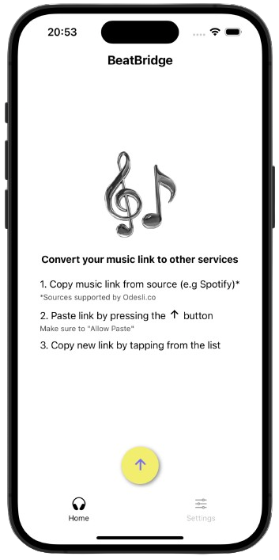

## MusicShare is now BeatBridge

My music sharing app is now available for beta testing on iOS! I had to rename it to BeatBridge because most of the other names have been claimed. I'm glad I was able to get a working MVP out to the hands of the people who signed up. It's funny how quickly you get feedback after releasing a new product or feature.

### Main change requested

The biggest painpoints my users had interacting with the app was the lack of instruction when first using the app, and some sort of notice that their link had been pasted or that a network call had been made. In other words, my users want better visual feedback for what they should do or what happens when they tap on something.

This ended up working out for me, because I wanted to implement an animation library, Reanimated, to give my app a unique effect. Reanimated released their latest version about [a year ago](https://blog.swmansion.com/releasing-reanimated-3-0-17fab4cb2394), which means it's a good time to use the newest version in BeatBridge.

## Renaming to Beatbridge

Renaming can be tricky for complex or bigger apps, but using [react-native-rename](https://github.com/junedomingo/react-native-rename) made the name change quick and painless.

## Adding instructions

I don't use GPT language models to help me code as much anymore because I noticed that it probably takes me longer to fit the AI's answer into my context than it does to Google and fix the issue.

That being said, I use AI to generate images almost every day. Since the instructions to my app are pretty basic, adding an image to the pre-result screen would give it a better look. I used Midjourney to create an image of a few musical elements and added it to my screen. The result:



## Getting Started with Reanimated 3

I have a little experience with Reanimated 2 from previous jobs, but I never installed the library myself. A simple `yarn add react-native-reanimated` from the project folder and `pod install` inside the `ios` folder and Reanimated was ready to use.

The goal for this app is to be as easy and quick to use as possible. That being said, I don't want the app to look *too* basic. Having a simple loading animation along with a toast to pop up whenever a link is tapped are great touches to give users feedback on what the app is doing.

I also added an error pop up in case someone pastes a link that the service can't recognize.  Below is a demo of the app in use.


```jsx
// simplified for context
const Loading = () => {
  // set shared value for Reanimated to use
  const opacity = useSharedValue(0);

  // animation control
  useEffect(() => {
    // withRepeat + withString are from the 'react-native-reanimated' lib
    opacity.value = withRepeat(withSpring(1), 0, true);
  }, []);

  return (
    // Animated.View is a Reanimated component
    <Animated.View style={{ opacity: opacity }}>
      <FastImage
        source={require('assets/image.png')}
        style={styles.loadingImage}
      />
      <Text style={styles.mainText}>Fetching link information</Text>
    </Animated.View>
  );
};
```

In order to make the loading animation, I set a shared value that Reanimated can recognize for the opacity of the entire `Animated.View` component with `const opacity = useSharedValue(0)`. This allowed me to animate the view within the `useEffect()` method with `withRepeat` and `withSpring` for a repeating fade in and out.

## Next Steps

Since the app has been available for testing for the past few days, user feedback has shown me that I was building this app with bias towards the user that wants to **send** a music link to someone else.

In order to make up for that, I need to implement a feature that helps a user that receives a music link from a platform that they don't use.

### New feature

The upcoming feature for BeatBridge Beta v3 is the ability to paste a music link and be forwarded to the music platfrom of your choice for easy listening.

Thanks for following along with BeatBridge!